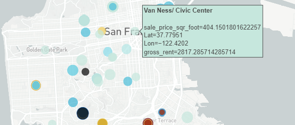
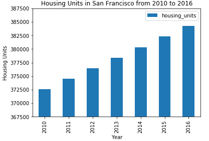
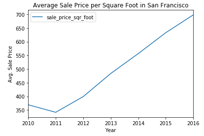
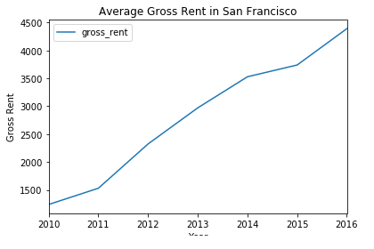
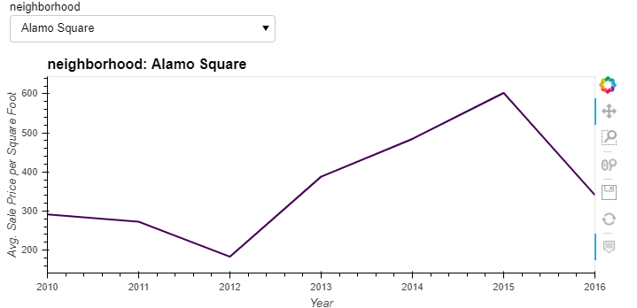
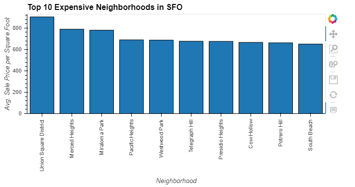
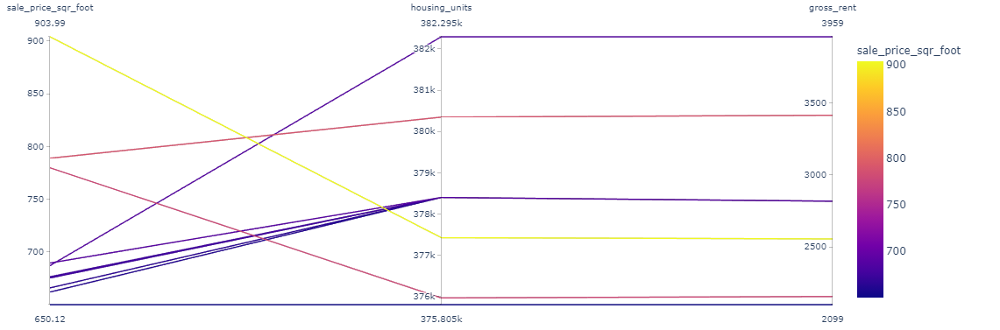
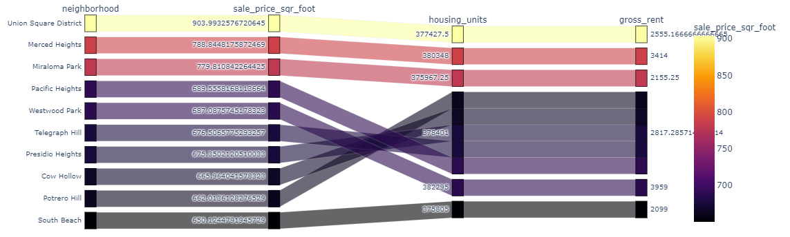

# pyviz Homework 6

# Real Estate Analysis of San Francisco from 2010 to 2016

## Background
Harold's company has just started a new Real Estate Investment division to provide customers with a broader range of portfolio options. The real estate team wants to trial this initial offering with investment opportunities for the San Francisco market. If the new service is popular, then they can start to expand to other markets.

This dashboard is provided as a solution to the above request. The goal of this dashboard is to provide charts, maps, and interactive visualizations that help customers explore the data and determine if they want to invest in rental properties in San Francisco.

## How to use the dashboard

*   **Serving up the dashboard on a browser**

    This dashboard can be served up in a browser. Please run the panel serve from the directory which has the dashboard.ipynb
    ````
    conda activate pyvizenv
    panel serve --show dashboard.ipynb
    ````

The dashboard is divided into four separate tabs as detailed below:
*   **Welcome**

    This tab is the starter and defualt tab the customer will see when the dashboard is launched. This includes an interactive map of San Francisco area. Users can hover over the variably colored rounds on the San Francisco are map. This will provide them the details such as shown below for Van ness Neighborhood. It shows the neighborhood name along with the latitude, longitude, sales per square foot price and gross rent.

    

*   **Housing Analysis**

    This tab shows three plots for San Franciso area

    *   A bar chart of housing units sold in San Francisco area from 2010 to 2016

        
    *   A line plot of average sales price per square foot area from 2010 to 2016
    
        
    *   A line plot of Average gross rent in San Francisco area from 2010 to 2016
    
        


*   **Neighborhood Analysis**

    This tab shows two plots:

    *   First plot is an interactive pull down plot helping the user to interactively select the neighborhood to find the average sales price per square foot for a neighborhood. If user selects neighborhood Van Ness/Civic Center, the plot shows it for this neighborhood only from years 2010 to 2016. 

        

    *   Second plot gives the top 10 expensive neighborhoods in San Francisco area from 2010 to 2016 based on the average sales price per square foot

        


*   **Parallel Plots Analysis**

    *   Parallel co-ordinates plot of the top 10 expensive neighborhoods showing sales price per square foot, housing units and gross rent for a colored index on sales price per square foot
    
        

    *   Parallel categories plot of the top 10 expensive neighborhoods showing neighborhood sales price per square foot, housing units and gross rent for a colored index on sales price per square foot

        


